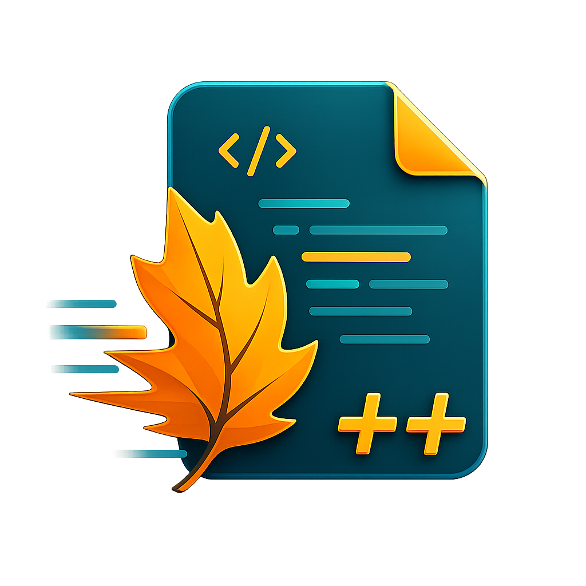

# Listopad++

<p align="center">
  
</p>

Listopad++ — быстрый нативный текстовый редактор для Windows 10 2004+ и
Windows 11. Он написан на C++20/Win32, быстро запускается и во время работы не
обращается к сети. В приложении нет телеметрии, новостей, рекламы, фонового
процесса, автообновления и загрузки плагинов.

Текущая версия: **0.1.1**. История изменений приведена в
[CHANGELOG.md](CHANGELOG.md).

## Возможности

- один экземпляр на пользователя Windows, вкладки и передача новых файлов уже
  запущенному редактору через локальный именованный канал;
- поддержка Unicode-путей, пробелов, UNC и путей длиннее 260 символов;
- статически встроенные Scintilla 5.6.4 и Lexilla 5.5.1: подсветка синтаксиса,
  сворачивание блоков, номера строк и ручной выбор всех штатных лексеров;
- раздельная подсветка HTML, JavaScript и CSS внутри `<style>`;
- локальная подсветка BSL (`.bsl`) и OneScript (`.os`) с кириллическими
  идентификаторами, без BSL Server и фонового языкового сервера;
- системная светлая или тёмная тема;
- внутреннее представление текста в UTF-8 со строгим распознаванием BOM и UTF,
  резервным определением legacy-кодировки через uchardet и ручным переоткрытием
  в UTF-8, UTF-16, Windows-1251, Windows-1252 или CP866;
- сохранение исходной кодировки, BOM и типа окончания строк;
- форматирование JSON, XML и HTML как одной отменяемой операции;
- Emmet 2.4.11 для HTML/XML/JSX и CSS-подобных языков на лениво создаваемом
  QuickJS-NG runtime;
- неблокирующий поиск и замена на PCRE2 10.47 с UTF/UCP/JIT, regexp,
  `$0`/`$1…$99`/`${name}`, поиском по выделению и всем вкладкам;
- реакция на внешнее изменение файла с явным выбором «Перезагрузить» или
  «Оставить» и защитой от перезаписи более новой дисковой версии;
- атомарное сохранение и UAC-broker: защищённый файл сохраняется после одного
  запроса UAC без перезапуска редактора и повторного поиска файла;
- виртуализированный read-only режим для файлов от 128 МиБ с memory mapping и
  асинхронным поиском;
- классическое контекстное меню через HKCU и современная команда
  `IExplorerCommand` для Windows 11.

В версию 0.1.1 не входят поиск по каталогам, hex-просмотр, diff/merge, плагины,
LSP, автодополнение, восстановление после сбоя, восстановление сессии и
автообновление.

## Командная строка

```text
ListopadPP.exe [--line N[:M]] [--encoding NAME] <file...>
ListopadPP.exe --register-context-menu
ListopadPP.exe --unregister-context-menu
```

Примеры кодировок: `utf-8`, `utf-8-bom`, `utf-16le`, `utf-16be`,
`windows-1251`, `windows-1252` и `cp866`.

Команды `--register-context-menu` и `--unregister-context-menu` управляют
только классическим HKCU-пунктом. Он предназначен для portable-сборки без
установленного sparse identity package. Одновременная регистрация классического
пункта и современного `IExplorerCommand` не нужна: иначе в дополнительном меню
Windows 11 появятся две одинаковые команды.

## Сборка

Требования:

- Windows x64;
- Visual Studio 2022 Build Tools с MSVC;
- Windows 10/11 SDK;
- CMake 3.29+, Ninja, Git и PowerShell 7 либо Windows PowerShell.

Зависимости закреплены в `vcpkg.json`. Scintilla и Lexilla загружаются CMake из
зафиксированных источников с проверкой версии или SHA-256.

```powershell
./scripts/bootstrap-vcpkg.ps1
./scripts/build.ps1 -Preset debug
./scripts/build.ps1 -Preset release
```

Прямой эквивалент для Debug-сборки:

```powershell
$env:VCPKG_ROOT = "$PWD/.deps/vcpkg"
cmake --preset debug
cmake --build --preset debug --parallel
ctest --preset debug --output-on-failure
```

## Упаковка и подпись

Для создания MSI в дополнение к portable ZIP и sparse identity MSIX установите
WiX v5:

```powershell
dotnet tool install --global wix --version "5.*"
./scripts/package.ps1 -Version 0.1.1
```

Версию нужно указывать явно. В v4 нет элемента `<Files>`, которым описываются
наборы логотипов и лицензий, а v6 и v7 требуют принять платную лицензию
Open Source Maintenance Fee.

Неподписанная сборка запускается как обычно, но UAC-сохранение и современное
контекстное меню Windows 11 намеренно отключаются. Для локальной разработки
можно явно создать тестовый сертификат:

```powershell
./scripts/new-dev-certificate.ps1
$password = ConvertTo-SecureString 'listopad-dev-only' -AsPlainText -Force
./scripts/package.ps1 -PfxPath ./.deps/signing/ListopadPP.Development.pfx -PfxPassword $password
```

Основной EXE, UAC-helper, Shell DLL, MSIX и MSI должны быть подписаны одним
сертификатом. Production CI принимает сертификат через защищённые secrets либо
внешний signing service.

В portable-сборке классическое меню регистрируется командой
**Инструменты → Зарегистрировать классическое контекстное меню**. Изменения
вносятся только в `HKCU\Software\Classes`; команда удаления полностью убирает
эту регистрацию.

## Настройки

Обычная установка хранит настройки в
`%LOCALAPPDATA%\Listopad++\settings.json`. Если рядом с EXE находится
`portable.flag`, используется `settings.json` из каталога приложения.

Основные параметры: `uiLanguage` (`ru`/`en`), `theme`
(`system`/`light`/`dark`), `fontFace`, `fontSize`, `indentSize`,
`indentWithTabs` и `largeFileThreshold` в байтах.

## Разработка и безопасность

Архитектура описана в [docs/ARCHITECTURE.md](docs/ARCHITECTURE.md), выпуск
релизов — в [docs/PUBLISHING.md](docs/PUBLISHING.md), границы доверия — в
[SECURITY.md](SECURITY.md).

Изменения принимаются только через pull request. Правила участия приведены в
[CONTRIBUTING.md](CONTRIBUTING.md).
